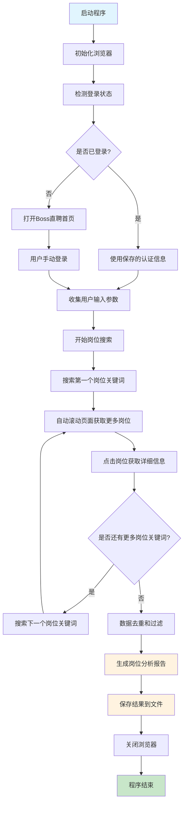

# Boss直聘AI Agent岗位分析工具

## 1. 功能介绍

这是一个基于Python的Boss直聘网站爬虫工具，专门用于分析和检索开发相关岗位信息。主要功能包括：

### 核心功能
- **智能岗位搜索**: 支持多关键词搜索，自动滚动页面获取更多岗位信息
- **岗位信息抓取**: 自动获取岗位列表和详细描述信息
- **智能过滤**: 根据学历、薪资、经验等条件自动过滤匹配的岗位
- **数据去重**: 自动去除重复的岗位信息
- **面试分析**: 生成结构化的岗位分析报告，为面试提供参考
- **灵活配置**: 岗位名称完全由用户自定义输入，支持任何开发相关岗位

### 技术特点
- 使用Playwright进行网页自动化，支持反爬虫检测
- 异步并发处理，提高数据获取效率
- 智能页面滚动，自动获取更多岗位数据
- 支持用户认证状态保存，避免重复登录
- 使用Jinja2模板引擎生成分析报告

## 2. 使用说明

### 环境要求
- Python 3.12+
- 支持的操作系统：Windows, macOS, Linux

### 安装依赖
```bash
# 使用uv包管理器安装依赖
uv sync
```

### 安装浏览器驱动
```bash
# 安装Playwright浏览器
playwright install chromium
```

### 运行程序
```bash
# 进入项目目录
cd boss_analysis

# 运行主程序
uv run src/main.py
```

### 使用流程
1. **启动程序**: 运行`main.py`后会自动打开浏览器
2. **用户输入**: 按提示输入搜索条件：
   - 岗位名称（支持多个，用逗号分隔，如：Python开发、前端工程师、算法工程师等）
   - 学历要求
   - 期望薪资范围
   - 工作经验
   - 其他补充信息
   - 最大检索岗位数量
3. **自动搜索**: 程序会自动在Boss直聘网站搜索并获取岗位信息
4. **结果生成**: 程序会生成分析报告并保存到`data/prompt.txt`

### 配置说明
- **岗位类型**: 支持任何开发相关岗位，如前端、后端、算法、测试、运维等
- **薪资范围**: 支持20-30K、30-50K、50-100K等范围
- **学历要求**: 支持大专、本科、硕士、博士等学历层次
- **岗位过滤**: 自动过滤产品、运营、市场、销售等非技术岗位

## 3. 程序运行流程图



### 详细流程说明

1. **初始化阶段**
   - 启动Playwright浏览器
   - 加载反爬虫插件
   - 检测用户登录状态

2. **用户交互阶段**
   - 收集搜索参数（包括用户自定义的岗位名称）
   - 确认是否使用已有数据

3. **数据获取阶段**
   - 根据用户输入的岗位关键词自动搜索
   - 智能页面滚动获取更多数据
   - 点击岗位获取详细信息
   - 拦截API响应获取结构化数据

4. **数据处理阶段**
   - 数据去重处理
   - 根据用户条件过滤岗位
   - 生成分析报告模板

5. **结果输出阶段**
   - 保存岗位列表到JSON文件
   - 生成面试分析提示词
   - 输出到指定文件

### 文件结构说明
```
boss_analysis/
├── src/                    # 源代码目录
│   ├── main.py            # 主程序入口
│   ├── search_job.py      # 爬虫核心逻辑
│   ├── template.py        # 报告模板生成
│   ├── config.py          # 配置文件
│   ├── local_type.py      # 类型定义
│   └── util/              # 工具函数
│       ├── common.py      # 通用过滤逻辑
│       ├── fs.py          # 文件操作
│       └── input.py       # 用户输入处理
├── data/                  # 数据存储目录
│   ├── prompt.txt         # 生成的面试分析报告
│   ├── joblist.json       # 岗位列表数据
│   ├── jobdetail.json     # 岗位详情数据
│   └── user_input.json    # 用户输入配置
├── pyproject.toml         # 项目配置文件
└── README.md              # 项目说明文档
```

### 注意事项
- 首次使用需要手动登录Boss直聘账号
- 登录状态会自动保存，避免重复登录
- 未登录状态下只能获取有限数量的岗位信息
- 建议合理设置搜索参数，避免获取过多无关数据
- 程序运行过程中请勿手动关闭浏览器，程序会自动处理

### 故障排除
- 如果浏览器启动失败，请检查Playwright是否正确安装
- 如果登录状态异常，可以删除`data/auth_zhipin.json`文件重新登录
- 如果页面加载缓慢，可以适当调整等待时间参数
- 如果遇到反爬虫限制，程序会自动使用反检测技术

---

*本项目仅供学习和研究使用，请遵守相关网站的使用条款和法律法规。*