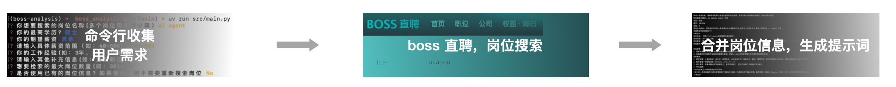
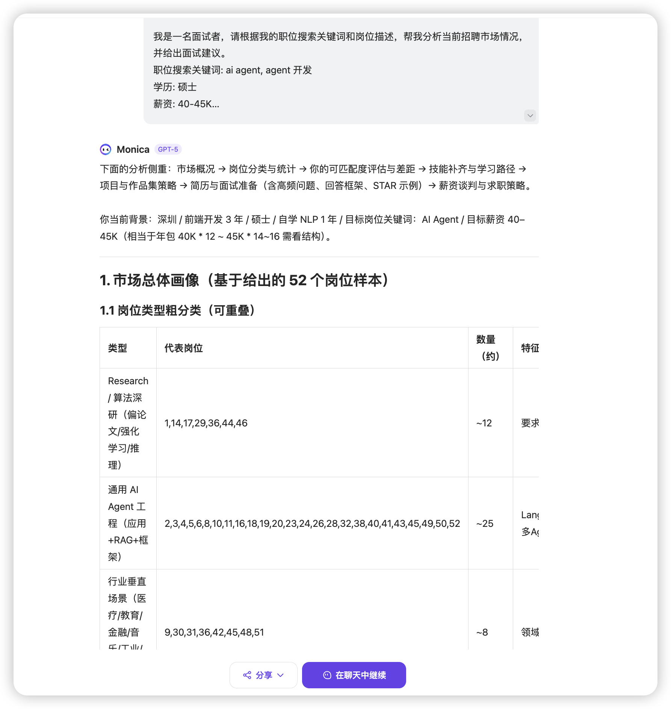

# Boss直聘岗位分析工具


## 1. 功能介绍

这是一个基于Python的Boss直聘网站爬虫工具,专门用于分析和检索开发相关岗位信息,最终输出的是多个岗位合并后的提示词。
```岗位提示词
我是一名面试者，请根据我的职位搜索关键词和岗位描述，帮我分析当前招聘市场情况，并给出面试建议。
职位搜索关键词: ai agent, agent 开发
学历: 硕士
薪资: 40-45K
经验: 3
其他补充信息: 我现在在深圳的一家电商公司从事前端开发,自学了一年的 NLP 算法,想转行做 ai agent 开发
详细岗位列表描述如下:
<岗位1>
岗位名称: 【博士】AI Agent领域推理大模型研究
薪资范围: 40-70K·16薪
学历要求: 博士
经验要求: 在校/应届

岗位职责：
1、洞察大模型技术路径，进行领域推理模型的路线规划和技术选型；
2、构建面向GTS服务作业的领域推理大模型，使能AI Agent完成领域任务达成高成功率的目标。
任职要求：
1、研究背景：计算机科学、统计学、应用数学、电子信息工程、运筹优化、数学、管理工程、自动化等相关专业领域。具有深厚机器/深度学习理论知识基础以及成功项目实践；研究领域包括但不限于：语言大模型、监督学习、半监督学习、联邦学习、 深度学习、强化学习及模式识别等
2、熟练掌握一种编程语言（Python、Java、C++/C）
3、综合素质：具备卓越的数学建模能力、系统思维能力、团队合作能力和结构化表达能力。
4、学术成就：
(必选)发表过3+领域相关的顶刊顶会
(加分项):具有机器学习类大型项目的开发和设计经验，并成功应用于商业领域，发挥作用；在KDD、Kaggle、天池、CCF、ACM等大赛中获得Top级奖项；
</岗位1>

<岗位2>
岗位名称: 【web3 AI项目】AI-agent工程师
薪资范围: 35-45K
学历要求: 本科
经验要求: 3-5年
技能要求: Defi, 深度学习, web3, AI, RAG, Python
工作职责
1、开发 AI-Agent：利用 LLMs 和机器学习设计和实现自主 AI-Agent，根据用户输入和市场情况执行链上操作（例如，代币转账、交换、收益优化）。
 2、LLM 集成：利用 LLMs（例如 Grok、基于 GPT 的模型）与 AutoGen 等工具，实现自然语言处理，使代理能够处理链上操作和多步对话。
 3、代理协作：使用 CrewAI 等框架创建协调任务的多代理系统（例如，一个代理分析趋势，另一个执行交换）。
 4、数据管道开发：构建管道，预处理并提供实时数据给 AI-Agent，包括链上指标（通过 The Graph 等 API）和离链来源（例如价格数据源、KOL 推文、媒体新闻）。
 5、代理优化：通过 RAG、LLM 微调或内存持久性等技术增强代理功能，实现上下文感知。
 6、合作：与区块链工程师合作，将 AI-Agent 与 DeFi 协议（例如 Perp、Spot、Loan）和智能合约集成，确保无缝链上执行。
 7、研究与创新：探索前沿 AI 工具（例如 AutoGen、CrewAI）和 DeFAI 趋势，推进代理功能。

要求
经验：
1、3年以上软件工程经验，专注于 AI、LLMs 或机器学习开发。
2、在生产环境部署 AI/ML 模型的经验。
技术技能：
1、精通 Python 和 AI/ML 框架（例如 TensorFlow、PyTorch、Hugging Face Transformers）。
2、对 LLMs 有深入了解，包括微调、提示工程和 API 集成（例如 xAI、OpenAI）。
3、熟悉 AutoGen 或 CrewAI 等 AI 代理框架，用于构建自主或多代理系统。
4、有数据管道和处理大型数据集的经验（例如 Pandas、NumPy，或云工具如 AWS/GCP）。
5、对区块链/DeFi 概念（例如钱包、交易）和 Web3 库（例如 Web3.py、ethers.js）有基本了解。
6、编程语言：Python（主要），JavaScript/TypeScript 为加分项。
7、对 AI、LLMs 及其在 DeFi/Web3 创新中的应用充满热情。
 
首选资格：
1、使用 AutoGen 进行基于 LLM 的代理开发或使用 CrewAI 进行多代理协调的经验。
2、熟悉 DeFi 协议（例如 Uniswap、Curve）和链上数据工具（例如 The Graph、Chainlink）。
3、对开源 AI 或 DeFi 项目有贡献（例如 GitHub 仓库）。
4、解 RAG 框架（例如 LangChain、LlamaIndex）或代理生态系统如 Autonolas。
</岗位2>
...
```

使用 AI 工具分析提示词的最终效果, 参考链接: https://monica.im/share/chat?shareId=RR10Nw8rpJwOaYEx


### 核心功能
- **智能岗位搜索**: 支持多关键词搜索，自动滚动页面获取更多岗位信息
- **岗位信息抓取**: 自动获取岗位列表和详细描述信息
- **智能过滤**: 根据学历、薪资、经验等条件自动过滤匹配的岗位
- **数据去重**: 自动去除重复的岗位信息
- **面试分析**: 生成结构化的岗位分析报告，为面试提供参考
- **灵活配置**: 岗位名称完全由用户自定义输入，支持任何开发相关岗位

### 技术特点
- 使用Playwright进行网页自动化，支持反爬虫检测
- 异步并发处理，提高数据获取效率
- 智能页面滚动，自动获取更多岗位数据
- 支持用户认证状态保存，避免重复登录
- 使用Jinja2模板引擎生成分析报告

## 2. 使用说明

### 环境要求
- Python 3.12+
- 支持的操作系统：Windows, macOS, Linux

### 安装依赖
```bash
# 使用uv包管理器安装依赖
uv sync
```

### 安装浏览器驱动
```bash
# 安装Playwright浏览器
playwright install chromium
```

### 运行程序
```bash
# 进入项目目录
cd boss_analysis

# 运行主程序
uv run src/main.py
```

### 使用流程
1. **启动程序**: 运行`main.py`后会自动打开浏览器
2. **用户输入**: 按提示输入搜索条件：
   - 岗位名称（支持多个，用逗号分隔，如：Python开发、前端工程师、算法工程师等）
   - 学历要求
   - 期望薪资范围
   - 工作经验
   - 其他补充信息
   - 最大检索岗位数量
3. **自动搜索**: 程序会自动在Boss直聘网站搜索并获取岗位信息
4. **结果生成**: 程序会生成分析报告并保存到`data/prompt.txt`

### 配置说明
- **岗位类型**: 支持任何开发相关岗位，如前端、后端、算法、测试、运维等
- **薪资范围**: 支持20-30K、30-50K、50-100K等范围
- **学历要求**: 支持大专、本科、硕士、博士等学历层次
- **岗位过滤**: 自动过滤产品、运营、市场、销售等非技术岗位

### 注意事项
- 建议登录Boss直聘账号，登录后按回车继续搜索
- 登录状态会自动保存，避免重复登录
- 未登录状态下只能获取有限数量的岗位信息
- 建议合理设置搜索参数，避免获取过多无关数据
- 程序运行过程中请勿手动关闭浏览器，程序会自动处理

### 故障排除
- 如果浏览器启动失败，请检查Playwright是否正确安装
- 如果登录状态异常，可以删除`data/auth_zhipin.json`文件重新登录
- 如果页面加载缓慢，可以适当调整等待时间参数
- 如果遇到反爬虫限制，程序会自动使用反检测技术

---

*本项目仅供学习和研究使用，请遵守相关网站的使用条款和法律法规。*